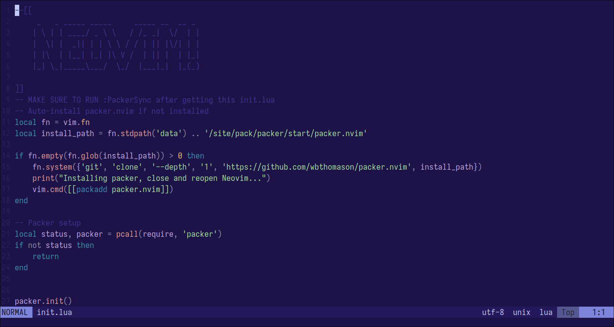
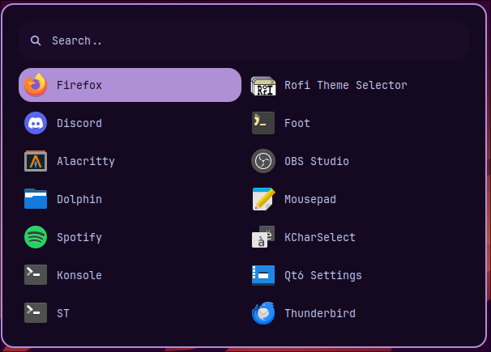
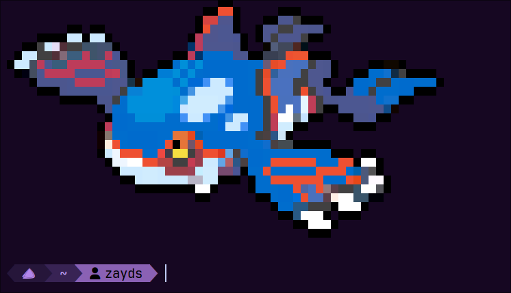

# Hyprland Dotfiles
Hyprland is a Wayland tiling window manager and compositor.\
Here are my dotfiles for it.
## Packages
```
gjs-hyprpanel
hyprland
swww
foot
rofi-wayland
grim
slurp
nvim
fish
starship
```
gjs-hyprpanel, simply known as hyprpanel, must be built form source.

The instructions for building it are at their [website](https://hyprpanel.com/getting_started/installation.html)

Swww is a wallpaper utility.

Foot is a terminal emulator.

Grim and slurp are screenshot utilities.

Fish is a shell.

Nvim, or neovim, is a vim based code editor.

Starship is used to customize your terminal prompt.

You will also need the hyprcursor and xcursor theme of Bibata-Modern-Classic.


You can find instructions on how to install these dependencies for your own distro, by looking at their GitHub repos.

### How do you use these dotfiles?
First, clone the repo with this command in the terminal:

```
git clone https://github.com/zayd-saqib/hyprland-dotfiles.git
```

Next, change directory into the cloned repo:

```
cd hyprland-dotfiles
```

Now, before you copy the configurations, **MAKE SURE** that these folders are not in your .config folder. (The .config folder is a folder which holds your program's configurations. It is located at `~/.config` It is a hidden folder, meaning it is not shown by default.)

The list of folders that should **NOT** be there are:

```
hypr
nvim
foot
rofi
fish
```

Also, if there is a file in your .config folder called `starship.toml`, you should delete it.

Now you can copy the configurations over to your .config folder.

Run this command to copy the configuration folders over: (Also make sure you're in the `hyprland-dotfiles` folder.)

```
cp -r fish foot hypr nvim rofi ~/.config && cp starship.toml ~/.config
```

Now the configurations should be installed on your system. However, Hyprpanel and Neovim are still not complete.

### Hyprpanel Setup
First, build Hyprpanel. You can get the instructions [here.](https://hyprpanel.com/getting_started/installation.html)\
Next, in the terminal, type this command:
```
hyprpanel toggleWindow settings-dialog
```
This should open the hyprpanel settings menu.

Next, in the "General" tab of the "Configuration" group, there is an option to import a config.

Click the "import" button and select the "config.json" file in the "hyprpanel" folder of my repo.

The configuration should be imported.


Next, go to the "Theming" group. In the "General Settings" tab, there should be an option to import a theme.\
Click the "import" button, and choose the "theme.json" file in the "hyprpanel" folder of my repo.\
Now Hyprpanel should be fully set up.

### Neovim setup.
Before you get started with moving the config over to the neovim config folder, install Packer. Packer is a Neovim plugin manager in which you can install plugins. Once installed, you can now move the config from my repo over to your neovim config folder.

To install Packer on your system, run this command:

```
git clone --depth 1 https://github.com/wbthomason/packer.nvim ~/.local/share/nvim/site/pack/packer/start/packer.nvim
```

Initially, you will see a lot of errors after starting Neovim.

Ignore those errors.

After you're in Neovim, run the `:PackerSync` command.

This command installs all the packages and makes sure they're up to date.

Restart Neovim, and Neovim should be ready now.

## Screenshots.

### Hyprland and Hyprpanel


### Neovim



### Rofi



### Foot, Starship, and Fish



Thanks for checking out my dotfiles!
