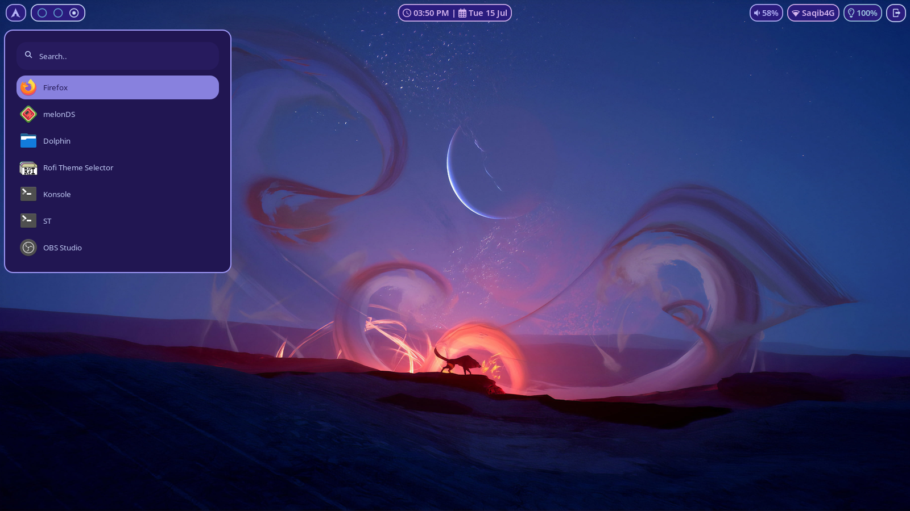

# Hyprland Dotfiles
Hyprland is a Wayland tiling window manager and compositor.\
Here are my dotfiles for it.
## Packages
```
waybar
hyprland
dunst
swww
foot
rofi-wayland
grim
slurp
nvim
fish
starship
```
Waybar is a status bar.

Swww is a wallpaper utility.

Foot is a terminal emulator.

Grim and slurp are screenshot utilities.

Fish is a shell.

Nvim, or neovim, is a vim based code editor.

Starship is used to customize your terminal prompt.

Dunst is a notification service.

You will also need the hyprcursor and xcursor theme of Bibata-Modern-Classic.

The fonts used are Iosevka Nerd Font for the terminal and rofi, the Symbols Nerd Font to get icons in waybar, and Noto Sans for the actual font. Ubuntu Nerd Font is used for the dunst config. All of these fonts (except Noto Sans) are available at [the nerd font website.](https://nerdfonts.com)\
Noto Sans is available [here](https://fonts.google.com/noto/specimen/Noto+Sans)


You can find instructions on how to install these dependencies for your own distro, by looking at their GitHub repos.

### How do you use these dotfiles?
First, clone the repo with this command in the terminal:

```
git clone https://github.com/zayd-saqib/hyprland-dotfiles.git
```

Next, change directory into the cloned repo:

```
cd hyprland-dotfiles
```

Now, before you copy the configurations, **MAKE SURE** that these folders are not in your .config folder. (The .config folder is a folder which holds your program's configurations. It is located at `~/.config` It is a hidden folder, meaning it is not shown by default.)

The list of folders that should **NOT** be there are:

```
waybar
hypr
nvim
dunst
foot
rofi
fish
```

Also, if there is a file in your .config folder called `starship.toml`, you should delete it.

Now you can copy the configurations over to your .config folder.

Run this command to copy the configuration folders over: (Also make sure you're in the `hyprland-dotfiles` folder.)

```
cp -r fish foot hypr nvim rofi waybar dunst ~/.config && cp starship.toml ~/.config
```

Now the configurations should be installed on your system. However, Neovim is still not complete.

### Neovim setup.
Before you get started with moving the config over to the neovim config folder, install Packer. Packer is a Neovim plugin manager in which you can install plugins. Once installed, you can now move the config from my repo over to your neovim config folder.

To install Packer on your system, run this command:

```
git clone --depth 1 https://github.com/wbthomason/packer.nvim ~/.local/share/nvim/site/pack/packer/start/packer.nvim
```

Initially, you will see a lot of errors after starting Neovim.

Ignore those errors.

After you're in Neovim, run the `:PackerSync` command.

This command installs all the packages and makes sure they're up to date.

Restart Neovim, and Neovim should be ready now.

## Screenshots.

### Hyprland and Waybar


### Neovim


### Rofi



### Foot, Starship, and Fish


### Dunst


Thanks for checking out my dotfiles!
