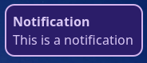

# Hyprland Dotfiles
Hyprland is a Wayland tiling window manager and compositor.\
Here are my dotfiles for it.
## Packages
```
waybar
hyprland
dunst
swww
foot
rofi-wayland
grim
slurp
nvim
fish
starship
wlogout
```

Waybar is a status bar (the bar that appears on the top of your screen.)\
Dunst is the notification service.\
S.W.W.W is the wallpaper setter.\
Foot is the temrinal (terrible name i know).\
Rofi is the app launcher.\
Grim and slurp are the screenshotting tools. (you most likely already have this installed but double check.)\
Nvim (neovim) is a text editor.\
Fish is the terminal shell.\
Starship is used to customize the terminal prompt.\
WLogOut is the logout menu.


You will also need the hyprcursor and xcursor theme of Bibata-Modern-Classic.

The fonts used are Noto Sans for rofi, Iosevka Nerd Font for the terminal, the Symbols Nerd Font to get icons in waybar, and Noto Sans for the actual font. Noto Sans is used for the dunst config. All of these fonts (except Noto Sans) are available at [the nerd font website.](https://nerdfonts.com)\
Noto Sans is available [here](https://fonts.google.com/noto/specimen/Noto+Sans)


You can find instructions on how to install these dependencies for your own distro, by looking at their GitHub repos.

For example, users running Arch and Arch-based distros (e.g. Manjaro, EndeavourOS, etc.) can run this command to install dependencies.
```
sudo pacman -S hyprland waybar swww foot rofi-wayland grim slurp neovim fish starship wlogout
```
For other distros, you're on your own.

**NOTE:** The configuration i have uses Nemo as the file manager. If you want to change it, go to ~/.config/hypr/configuration/programs.conf and change the $fileManager variable to another program.
### How do you use these dotfiles?
First, clone the repo with this command in the terminal:

```
git clone https://github.com/zayd-saqib/hyprland-dotfiles.git
```

Next, change directory into the cloned repo:

```
cd hyprland-dotfiles
```

Now, before you copy the configurations, **MAKE SURE** that these folders are not in your .config folder. If they do, backup those configurations somewhere else, because when you move my dotfiles here, they will overwrite the current configuration. (The .config folder is a folder which holds your program's configurations. It is located at `~/.config` It is a hidden folder, meaning it is not shown by default.)

The list of folders that should **NOT** be there are:

```
waybar
hypr
nvim
dunst
foot
rofi
fish
wlogout
```

Now you can copy the configurations over to your .config folder.

Run this command to copy the configuration folders over: (Also make sure you're in the `hyprland-dotfiles` folder.)

```
cp -r fish foot hypr nvim rofi waybar dunst ~/.config && cp starship.toml ~/.config
```

Now the configurations should be installed on your system. However, Neovim is still not complete.

### Neovim setup.
Before you get started with moving the config over to the neovim config folder, install Packer. Packer is a Neovim plugin manager in which you can install plugins. Once installed, you can now move the config from my repo over to your neovim config folder.

To install Packer on your system, run this command:

```
git clone --depth 1 https://github.com/wbthomason/packer.nvim ~/.local/share/nvim/site/pack/packer/start/packer.nvim
```

Initially, you will see a lot of errors after starting Neovim.

Ignore those errors.

After you're in Neovim, run the `:PackerSync` command.

This command installs all the packages and makes sure they're up to date.

Restart Neovim, and Neovim should be ready now.

## Screenshots.

### Hyprland and Waybar


### Neovim


### Rofi


### Foot, Starship, and Fish


### Dunst



### WLogOut


## Keyboard Shortcuts

**Super + T** = Execute Terminal Program\
**Super + Q** = Close Active Window\
**Super + M** = Log Out of Hyprland\
**Super + E** = Execute File Manager Program\
**Super + V** = Toggle Floating Mode for Windows\
**Super + R** = Execute App Launcher\
**Super + J** = Split layout of windows\
**Super + Left arrow key** = Change focus to the window to the left\
**Super + Right arrow key** = Change focus to the window to the right\
**Super + Up arrow key** = Change focus to the window to the top\
**Super + Down arrow key** = Change focus to the window to the bottom\
**Super + Number keys 1-9** = Change workspaces\
**Super + Shift + Number keys 1-9** = Move window to another workspace\
**Super + W** = Toggle Tabbed Mode\
**PrtSc** = Selection screenshot\
**Shift + PrtSc** = Fullscreen screenshot

Thanks for checking out my dotfiles!
